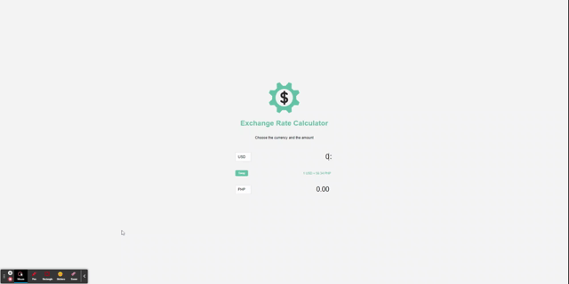

# Exchange Rate Conversion

## Table of Contents

- [Overview](#overview)
  - [The challenge](#the-challenge)
  - [Work in action](#work-in-action)
  - [Link](#link)
- [Built with](#built-with)
  - [What I learn](#what-i-learn)
- [Author](#author)

## Overview

    Introduction to API, third party API. Learning about JSON and dealing with DOM

### The challenge

## Work in action

## Link

## Built with

- HTML
- CSS
- flexbox
- Exhange rate API

### What I learn

Learned about third party API
## Author

- Github - [goldreb](https://github.com/goldreb)
- Frontend Mentor - [@yourusername](https://www.frontendmentor.io/profile/goldreb)
- Twitter - [@goldspycoder](https://twitter.com/goldspycoder)
- Linkedin - [Goldiluck](https://www.linkedin.com/in/goldiluck-rebollido/)